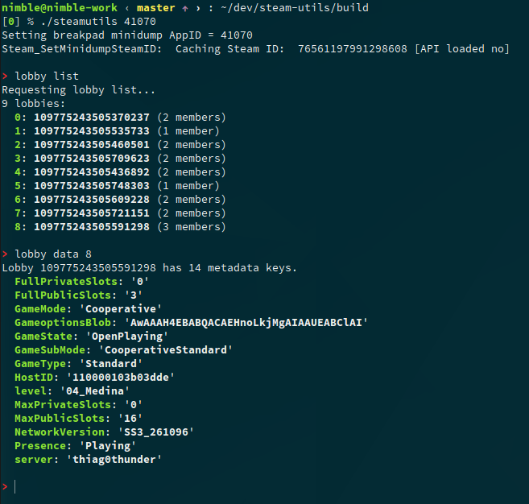

# Steam utils

Command line Steam utilities for debugging.

## Features

Currently supports:

* Lobbies
  * Listing lobbies
  * Data listing
  * Creating lobbies
* Stats
  * Getting and setting user stats
* Achievements
  * Listing achievements
  * Setting achievements
  * Clearing achievements
